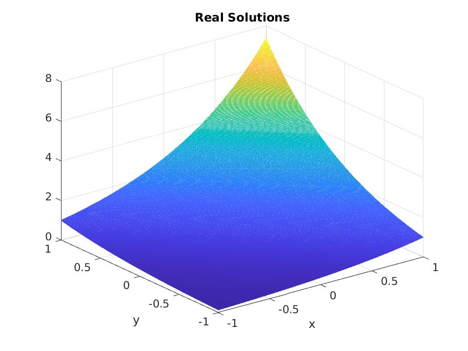
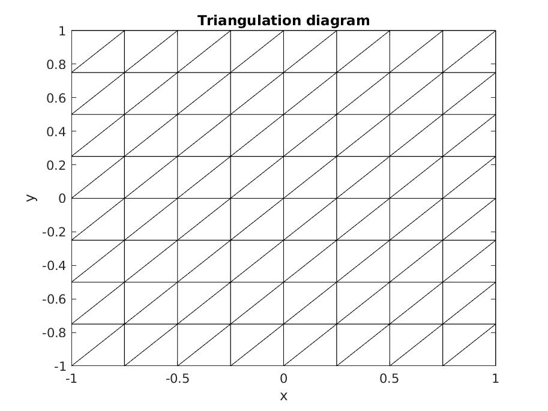
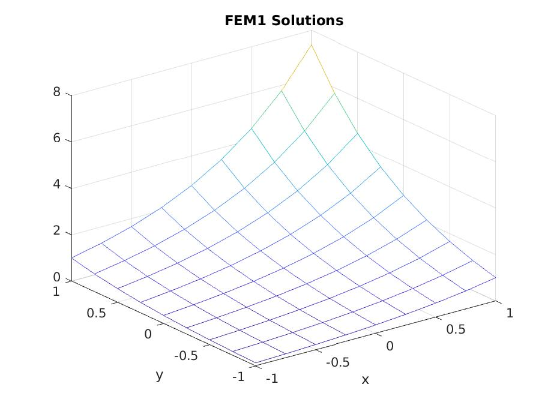

# PDE Finite Element Method
## This is the partial differential equation finite element method by using the Ritz-Galerkin method.
We use the finite element method of triangular dissection to solve practical problems, and the related computational algorithms all use the Gaussian numerical integration method in numerical analysis.

## Question:
Here are the simulation problems solved by the algorithm.

$$
\left\{
\begin{array}{c}
\left. -\nabla \cdot(\nabla u)+u=-e^{x+y},(x, y) \in[-1,1] \times[-1,1] \right. \\ 
\left. \mathrm{u}=\mathrm{e}^{-1+y}, \mathrm{x}=-1 \right. \\ 
\left. \mathrm{u}=\mathrm{e}^{1+y}, \mathrm{x}=1 \right. \\ 
\left. \nabla \mathrm{u} \cdot \overrightarrow{\mathrm{n}}=-\mathrm{e}^{\mathrm{x}-1}, \mathrm{y}=-1 \right. \\ 
\left. \mathrm{u}=\mathrm{e}^{\mathrm{x}+1}, \mathrm{y}=1 \right.
\end{array}
\right.
$$

In addition, we compare the errors between the finite element solution and the exact solution at different parametrizations for different mesh dissections.

## Code
If you want to use this code in your machine, you should fork my work and download the code in your computer. Then, you just need to run "PDE_main.m". Absolulately, you can change the parameters to get the different results.

## Result
This are some figures of the results.

- The solutions:

- The Grid sectioning_diagram:

- The FEM result:

If you think this work is uesful for yourself, please give me a star.

Thank you!
